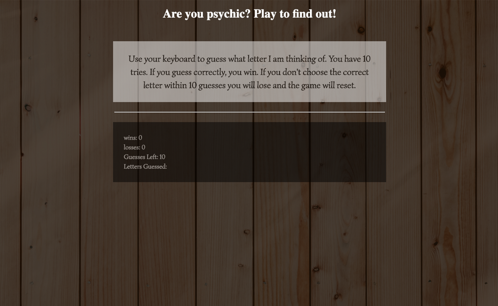

# psychic-game

<h2> <a href="https://ogilvie1231.github.io/psychic-game/">Play the Psychic Game</a></h2>
<!--  -->
&nbsp;
<h2>How it works</h2>

Upon start a random letter is selected. Every keystroke is a guess so be careful what you type. Your goal is to pick the right letter. If you can find the right letter within 10 guesses you win and your score goes up. If you are unable to find the right correct letter within your allotted 10 guesses you lose and your loss count will increase.

Built using HTML, CSS and JavaScript

